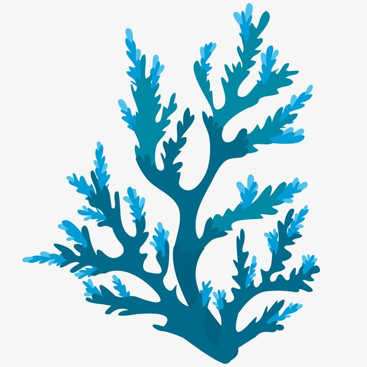

[](https://travis-ci.org/douyu/jupiter)
[](https://codecov.io/gh/douyu/jupiter)
[](https://pkg.go.dev/github.com/douyu/jupiter?tab=doc)
[](https://goreportcard.com/report/github.com/douyu/jupiter)


# Coral: 面向区块链应用开发的微服务开发框架

## 介绍 

Coral 我们致力于提供完整的区块链微服务研发体验，提供通用的智能合约开发接口，并对fabric更加友好的支持，提供易用的追踪服务，整合相关框架及工具后，微服务治理相关部分可对整体业务开发周期无感，从而更加聚焦于业务交付。

## 特性
* Log：类似[zap](https://github.com/uber-go/zap)的field实现高性能日志库，并结合log-agent实现远程日志管理；
* Trace：基于opentracing，集成了全链路trace支持（gRPC/HTTP/）；
* HLF: 简洁的hyperleger fabric sdk
* Contract：智能合约的通用接口,以及身份管理
* RPC：基于json的更灵活的抽象


## 快速开始 

### 版本要求

Go version>=1.14

### 按照

```shell
GO111MODULE=on && go get -u github.com/snlansky/coral
```
